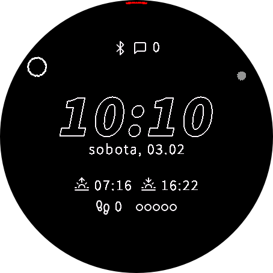

# Garmin Watch Face

I built myself a watch face that breaks the skeuomorphism – I didn't enjoy clock hands covering data fields, so I decieded to design hour, minute, and second hands to float near the screen edge.

## Used assets

### Clock hands

My design.

### Fonts

Older version of Source Sans Pro (Black Italic and Light versions).

### Icons

[Feather Icons](https://feathericons.com/) and [Material Symbols](https://fonts.google.com/icons).

## Work that I'm not planning to do

* Adding a settings screen to change data displayed on the watch face – coding all options and bundling all required icons is not something I am eager to do – I just don't need it.
* Adding translations.
* Adjusting to other devices.
* Figuring AOD modes.
